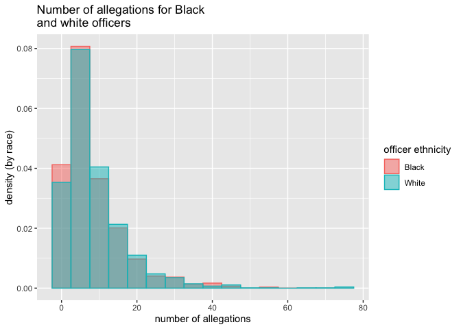

TDI Project Proposal Excerpt 1
================

``` r
library(tidyverse)
```

    ## Warning: package 'tidyverse' was built under R version 3.5.2

    ## Warning: package 'tibble' was built under R version 3.5.2

    ## Warning: package 'tidyr' was built under R version 3.5.2

    ## Warning: package 'purrr' was built under R version 3.5.2

    ## Warning: package 'dplyr' was built under R version 3.5.2

    ## Warning: package 'stringr' was built under R version 3.5.2

    ## Warning: package 'forcats' was built under R version 3.5.2

``` r
# had to hand-download this data because download requires agreement to
# Propublica's terms
police <- read.csv("./CCRB-Complaint-Data_202007271729/allegations_202007271729.csv")

officers <- police %>% 
        group_by(unique_mos_id, mos_ethnicity) %>% 
        count() %>%
        rename(num_allegations = n) %>%
        arrange(desc(num_allegations))

black_or_white_officers <- officers %>% 
        filter(mos_ethnicity %in% c("Black","White"))

g <- ggplot(black_or_white_officers, aes(x = num_allegations, fill = mos_ethnicity, color = mos_ethnicity)) + 
        geom_histogram(binwidth = 5, aes(y = ..density..), alpha=0.5, position="identity") + 
        labs(x = "number of allegations", y = "density (by race)", fill = "officer ethnicity", color = "officer ethnicity", title = "Number of allegations for Black\nand white officers")

g
```


