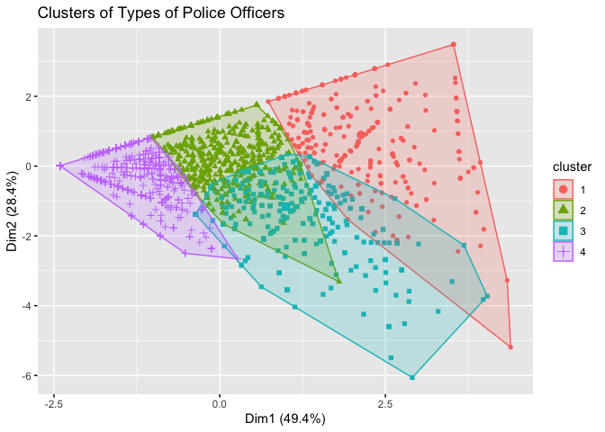

TDI Project Proposal Excerpt 2
================

``` r
library(tidyverse)
```

    ## Warning: package 'tidyverse' was built under R version 3.5.2

    ## Warning: package 'tibble' was built under R version 3.5.2

    ## Warning: package 'tidyr' was built under R version 3.5.2

    ## Warning: package 'purrr' was built under R version 3.5.2

    ## Warning: package 'dplyr' was built under R version 3.5.2

    ## Warning: package 'stringr' was built under R version 3.5.2

    ## Warning: package 'forcats' was built under R version 3.5.2

``` r
library(factoextra)
```

    ## Warning: package 'factoextra' was built under R version 3.5.2

``` r
police <- read.csv("./CCRB-Complaint-Data_202007271729/allegations_202007271729.csv")

officer_types <- police %>%
        group_by(unique_mos_id, fado_type) %>%
        count() %>%
        pivot_wider(names_from = fado_type, values_from = n) %>%
        rename(abuse = `Abuse of Authority`,
               rude = Discourtesy,
               lang = `Offensive Language`,
               force = Force) %>%
        mutate_at(c("abuse","rude","lang","force"), ~replace(., is.na(.), 0)) %>%
        mutate(total = abuse + rude + lang + force) %>%
        filter(total >= 4) %>%
        mutate(abuse = abuse / total, 
               rude = rude / total,
               lang = lang / total,
               force = force / total)

df <- officer_types %>% ungroup() %>% select(-unique_mos_id) %>% select(-total)
k <- kmeans(df, centers = 4, nstart = 20)

fviz_cluster(k, data = df, geom = "point", main = "Clusters of Types of Police Officers")
```


