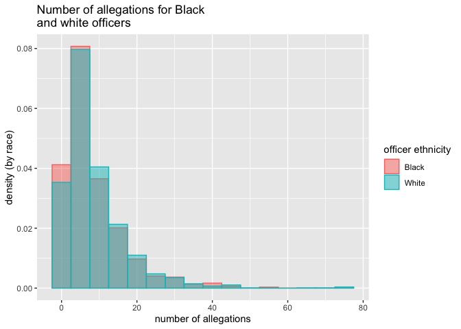

TDI Project Proposal: NYPD Misconduct
================

Introduction
------------

After the killing of George Floyd and the resulting civil unrest, demand for police accountability increased all over the nation. As a result, New York [recently repealed](https://www.innocenceproject.org/in-a-historic-victory-the-new-york-legislature-repeals-50-a-requiring-full-disclosure-of-police-disciplinary-records/) a statute barring access to police disciplinary records, and Propublica released a [dataset](https://www.propublica.org/datastore/dataset/civilian-complaints-against-new-york-city-police-officers) of police misconduct cases in July 2020. [Other states](https://project.wnyc.org/disciplinary-records/) also allow access to police disciplinary records. However, this data is not readily accessible to the public because 1) the data itself has not been digested yet, and 2) a path to access to the public records is legal but completely opaque.

The aim of this project is to bridge the gap between public understanding of police misconduct data and legally available but practically inaccessible datasets, allowing users to view tidy data and statistical analysis through an easy-to-use interface. While I will look for interesting relationships and analyses, I will place emphasis on wrangling and presenting data more than hard statistical analysis because 1) I want to prioritize user accessibility, and 2) I want to practice delivering a usable product. I will also find different ways to gather currently uncurated data.

I will conduct two examples of statistical analysis that could be included in the product.

Police Officer Misconduct by Race
---------------------------------

For example, we could compare the number of allegations against Black officers and the number against white officers. Of course, the proportion of Black officers to all officers is much smaller than that of white officers, so we plot the density of the number of allegations instead of the count.

``` r
library(tidyverse)
```

    ## Warning: package 'tidyverse' was built under R version 3.5.2

    ## Warning: package 'tibble' was built under R version 3.5.2

    ## Warning: package 'tidyr' was built under R version 3.5.2

    ## Warning: package 'purrr' was built under R version 3.5.2

    ## Warning: package 'dplyr' was built under R version 3.5.2

    ## Warning: package 'stringr' was built under R version 3.5.2

    ## Warning: package 'forcats' was built under R version 3.5.2

``` r
library(factoextra)
```

    ## Warning: package 'factoextra' was built under R version 3.5.2

``` r
# had to hand-download this data because download requires agreement to
# Propublica's terms
police <- read.csv("./CCRB-Complaint-Data_202007271729/allegations_202007271729.csv")

officers <- police %>% 
        group_by(unique_mos_id, mos_ethnicity) %>% 
        count() %>%
        rename(num_allegations = n) %>%
        arrange(desc(num_allegations))

black_or_white_officers <- officers %>% 
        filter(mos_ethnicity %in% c("Black","White"))

g <- ggplot(black_or_white_officers, aes(x = num_allegations, fill = mos_ethnicity, color = mos_ethnicity)) + 
        geom_histogram(binwidth = 5, aes(y = ..density..), alpha=0.5, position="identity") + 
        labs(x = "number of allegations", y = "density (by race)", fill = "officer ethnicity", color = "officer ethnicity", title = "Number of allegations for Black\nand white officers")

g
```

 Black officers seem slightly less likely to have a large number of allegations against them. This might be reason to probe further into the question of correlation between officer race and number, or quality, of allegations.

Types of Police Officers
------------------------

As another example, we can do cluster analysis on the officers. Are there distinct "types" of police officers that we can identify? For example, there may be officers who have high rates of allegations of verbal abuse, but are surprisingly nonviolent; or there may be officers who have higher rates of use of force than other officers with similar numbers of allegations. Let's do simple k-means clustering on officers based on number of allegations and proportions of types of allegations.

``` r
officer_types <- police %>%
        group_by(unique_mos_id, fado_type) %>%
        count() %>%
        pivot_wider(names_from = fado_type, values_from = n) %>%
        rename(abuse = `Abuse of Authority`,
               rude = Discourtesy,
               lang = `Offensive Language`,
               force = Force) %>%
        mutate_at(c("abuse","rude","lang","force"), ~replace(., is.na(.), 0)) %>%
        mutate(total = abuse + rude + lang + force) %>%
        filter(total >= 4) %>%
        mutate(abuse = abuse / total, 
               rude = rude / total,
               lang = lang / total,
               force = force / total)

df <- officer_types %>% ungroup() %>% select(-unique_mos_id) %>% select(-total)
k <- kmeans(df, centers = 4, nstart = 20)

fviz_cluster(k, data = df, geom = "point", main = "Clusters of Types of Police Officers")
```

 We can roughly see different types of officers. Cluster 4 seems to consist of officers who use a lot of force. Cluster 3 seems to consist of officers who commit abuse of authority but are not generally violent. And so on. Let's observe which cluster is most likely to have many allegations.

``` r
clusters <- k$cluster
officer_types$cluster = clusters
cluster_totals <- officer_types %>% 
        group_by(cluster) %>%
        summarize(mean(total))
cluster_totals
```

    ## # A tibble: 4 x 2
    ##   cluster `mean(total)`
    ##     <int>         <dbl>
    ## 1       1          9.18
    ## 2       2          9.68
    ## 3       3         13.6 
    ## 4       4         10.1

That didn't result in something very meaningful, but I did it out of pure interest. I think there are many hidden patterns to explore in this dataset.
