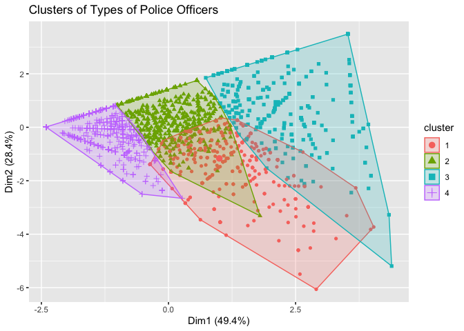

TDI Project Proposal Presentation: NYPD Misconduct
================

Introduction
------------

After the killing of George Floyd and the resulting civil unrest, demand for police accountability increased all over the nation. As a result, New York [recently repealed](https://www.innocenceproject.org/in-a-historic-victory-the-new-york-legislature-repeals-50-a-requiring-full-disclosure-of-police-disciplinary-records/) a statute barring access to police disciplinary records, and ProPublica released a [dataset](https://www.propublica.org/datastore/dataset/civilian-complaints-against-new-york-city-police-officers) of police misconduct cases in July 2020. [CAPstat](https://www.capstat.nyc/) is another project that aimed to shed light on police data before the restrictive statute was repealed. [Other states](https://project.wnyc.org/disciplinary-records/) also allow access to police disciplinary records, but the data has not been curated yet. 

The aim of this project is to bridge the gap between **public demand for increased police accountability** through granular data and the **current lack of non-technical access to that data**, allowing users to view tidy data and statistical analysis through an easy-to-use and interactive interface. Now is the perfect time to build an accessible window to police disciplinary data because political momentum on police accountability is currently high.

Where's the data?
-----------------

The main dataset is the ProPublica dataset, linked above. They did the hard work of requesting and transforming the data through legal barriers. But there are other related datasets to study. If the ProPublica dataset is the sun, then the planets would be the NYC public payroll data, NYPD police precinct map data, NYC crime data, NYPD officer data, and more. Below, I will present examples of such data we can use to augment the ProPublica dataset and our analysis.

Features
--------

There are three main features I will certainly build, and others that I have yet to completely scope out. I will present a sneak peek of each feature below.
1. *Geographic visualization.* I will build a compelling visualization of police activity and disciplinary records in the NYC geography, from 1985 to 2020. 
2. *Aggregate analysis of officers.* I will build tools for users to view and interact with aggregate analysis of police officers. For example, I may build a tool for users to observe behaviors of Asian officers, or male officers, or old officers. Users may be able to discern new groups of police officers (wait for the sneak peek).
3. *Individual analysis of officers.* I will build tools for users to view and interact with the public history of individual police officers.

Sneak peeks
-----------

## Geographic analysis

Click this [link](https://hongsuh7.github.io/precinct.html) to see an interactive visualization of allegations against police by precinct. I learned while building this plot that the NYPD 75th precinct is [infamous](https://en.wikipedia.org/wiki/The_Seven_Five) for the police corruption that took place in it during the 1980s. 

## Aggregate analysis of officers

Are there distinct "types" of police officers that we can identify with our data? For example, there may be officers who have high rates of allegations of verbal abuse, but are surprisingly nonviolent; or there may be officers who have higher rates of use of force than other officers with similar numbers of allegations. A simple k-means clustering on officers based on number of allegations and proportions of types of allegations yields interesting results.

 
```
    ##       abuse       rude       lang      force
    ## 1 0.4495329 0.32141697 0.04601956 0.18303057
    ## 2 0.6020816 0.09685358 0.01535157 0.28571323
    ## 3 0.2491451 0.17291401 0.02955641 0.54838447
    ## 4 0.8401839 0.07994415 0.00935996 0.07051199
```
We can roughly see different types of officers. Cluster 3 seems to consist of officers who use a lot of force. Cluster 4 seems to consist of officers who commit abuse of authority but are not generally violent. And so on. 

## Individual analysis of officers

Click this [link](https://hongsuh7.github.io/payroll.html) to see plots of compensation of an officer with 43 allegations from 2014-2019 versus that of a same-rank officer with no allegations. (Note that about 90% of NYPD officers have no allegations against them.) We all hear that police officers get away with misconduct, but it is another thing to see this plot and realize that allegations, even if substantiated, have absolutely no impact on officer compensation.

Conclusion
----------

I demonstrated three new ways to use data from different sources to shed light on police misconduct. The final product will occupy a niche that is currently empty -- that of interactive, flexible, and visual statistical information about police misconduct. Any work in this direction is of interest to the public, whose eyes are all over American police right now, and urgent, because political momentum is not easy to maintain. 
